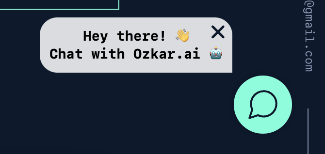

# Portfolio Chatbot Backend Application

This repository houses the backend application for the interactive chatbot featured on my portfolio website, [ozkaralvarez.com](https://ozkaralvarez.com). The chatbot is designed to provide visitors with a unique, engaging, and personalized experience, leveraging a fine-tuned OpenAI language model that is enriched with data about my professional journey and skills.

### 🚨 For guidelines on how to use and credit this work, see the [Proper Use and Credits](#proper-use-and-credits) section. 🚨

## Overview
The backend is built using Node.js and serves as the crucial link between the OpenAI API and the chatbot interface on the portfolio website. It processes incoming chat requests, interacts with the OpenAI model to generate responses, and manages the flow of conversation, ensuring a seamless and intelligent user interaction.

## Key Features
* **OpenAI API Integration:** Utilizes a fine-tuned OpenAI language model to generate relevant and personalized responses based on data about my experiences and expertise.
* **Rate Limiting Middleware:** Implements robust rate limiting to ensure the application's stability and security *(**note:** this component is not included in the repository for security reasons)*.
* **MongoDB Connection:** Connects to a MongoDB instance to store non-identifying chat history, aiding in maintaining a contextual and coherent chat experience.

## Screenshots

### Open Chat Button
<p align="center">
  
</p>

### Chatbot Response

<p align="center">

</p>

## Usage

This section guides you through setting up and running the Portfolio Chatbot Backend. As the repository is configured for security and privacy, certain components like the `.env` file, `middleware` folder, and `training_data.json` are excluded and need to be set up manually.

### Prerequisites
Before setting up the Portfolio Chatbot Backend, ensure that your system meets the following requirements:

1. **Node.js:** The backend is built on Node.js. Make sure you have Node.js installed on your system. You can download it from [Node.js official website](https://nodejs.org/en).

2. **NPM(Node Package Manager):** NPM is used for managing the dependencies. It comes bundled with Node.js, so if you have Node.js installed, you should have NPM as well.

3. **MongoDB:** The application uses MongoDB as its database. You need to have MongoDB set up on your system or have access to a MongoDB database. Visit [MongoDB's official site](https://www.mongodb.com/) for more details on installation and setup.

4. **OpenAI API Key:** You will need an API key from OpenAI for the chatbot to interact with the language model. You can obtain this by signing up on [OpenAI's website](https://openai.com/).

5. **Git:** To clone the repository, you'll need Git installed on your machine. You can download Git from [Git's official website](https://git-scm.com/).

### Initial Setup

1. **Clone the Repository**:

    ```sh
    git clone git@github.com:oalva-rez/portfolio-chat-bot.git
    ```

2. **Environment Variables**:
* Create a `.env` file in the root directory.
* Add your MongoDB connection string as `MONGODB_URI=<your_connection_string>`.
* Add your OpenAI API key as `OPENAI_API_KEY=<your_api_key>`.

3. **Middleware Setup**:
* As the middleware folder containing `rateLimiter.js` is not included in the repo for security reasons, create a middleware directory.
* Inside middleware, create a `rateLimiter.js` file and implement your rate-limiting logic.

4. **Training Data for OpenAI Model**:
* The `training_data.json` file, which contains the data used for fine-tuning the OpenAI model, is not included. Create this file with your custom training data.

### Running the Application

1. **Install Dependencies**:
   Navigate to the project directory and run:
   ```sh
    npm install
   ```

2. **Start the Dev Server**:
   Once the setup is complete, start the server by running:
   ```sh
    npm run dev
   ```
The server should now be running and able to handle requests from the chatbot interface on your portfolio website.

## Proper Use and Credits
I am delighted to share my work with the wider community and appreciate your interest in using it. To ensure that my work is used responsibly and with appropriate acknowledgment, please adhere to the following guidelines:

### Usage Guidelines
1. **Educational and Non-Commercial Use:** You are encouraged to use this backend application for educational purposes and non-commercial projects. For any commercial use, please contact me directly for permission.

2. **Code Modification:** While you are free to modify and adapt the code for personal use or contribution to the project, any public distribution of the modified code should clearly reference this original repository.

### Crediting
When using or referencing my work, proper credit should be given. This can be done in the following ways:

1. **In Documentation:** If you're using parts of the code or the entire project in your work, please include a reference to this repository in your project's documentation.

2. **In Publications or Presentations:** For any academic or professional publications, presentations, or articles that include results or insights gained from this project, a citation or acknowledgment is appreciated.

3. **On Web Platforms:** When showcasing projects that include this backend or its elements on web platforms (like GitHub, personal websites, or social media), please provide a link back to this repository.

## License
This work is licensed under a [Creative Commons Attribution-NonCommercial 4.0 International License](http://creativecommons.org/licenses/by-nc/4.0/).

